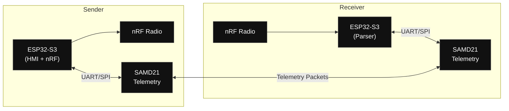

# 2026 Capstone Project  
## Dual‑MCU Drone Telemetry & Control System  
**ESP32‑S3 Mini + SAMD21 + nRF | Sender ↔ Receiver Architecture**

---

## Table of Contents
- 1. Project Overview
- 2. System Architecture Summary
  - Core Design Philosophy
- 3. Sender vs Receiver Roles
- 4. Repository Structure
- 5. System Mind Map
- 6. Data Flow Diagram
- 7. Phase 1 — Dev‑Board Bring‑Up (MANDATORY FIRST)
- 8. Phase 2 — PCB Design
- 9. Phase 3 — Firmware Development
- 10. Phase 4 — Drone Build
- 11. Phase 5 — Launch & PID Tuning
- 12. Phase 6 — RL Integration (Phase 1)
- 13. Definition of Done (DoD)
- 14. Weekly Execution Rules
- 15. Decision Log

---

## 1. Project Overview
This capstone project focuses on designing, building, and validating a **robust drone communication and control system** using a **dual‑MCU architecture** on both the sender and receiver sides.

The system is divided into Hardware, Firmware, Drone Integration, and Reinforcement Learning (RL) phases, with an emphasis on early dev‑board validation, modular PCB design, and fault‑tolerant communication.

---

## 2. System Architecture Summary

### Core Design Philosophy
- ESP32‑S3 Mini
  - High‑level application logic
  - RTOS multi‑tasking
  - nRF radio management
  - HMI handling
- SAMD21
  - Deterministic telemetry handling
  - Sender ↔ Receiver telemetry exchange
  - CRC, sequencing, and link health
- nRF Radio (per board)
  - Wireless data transport between modules

---

## 3. Sender vs Receiver Roles

### Sender Module
- ESP32‑S3
  - Sends outbound data via nRF
  - Runs HMI task
  - Supervises link health
- SAMD21
  - Receives telemetry from receiver SAMD21
  - Handles low‑level packet integrity

### Receiver Module
- ESP32‑S3
  - Receives nRF data
  - Parses and forwards data
- SAMD21
  - Exchanges telemetry with sender SAMD21
  - Reports link status

---

## 4. Repository Structure
Project directories (top level):

```
/hardware
  /pcb_sender
  /pcb_receiver
  /schematics
  /bom
  /rev_history

/firmware
  /esp32_sender
  /esp32_receiver
  /samd_sender
  /samd_receiver
  /common
  /protocol
  /crc
  /logging

/drone
  /frame
  /power
  /wiring
  /pid_tuning
  /flight_tests

/rl
  /dev_board_testing
  /simulation
  /training
  /integration

/docs
  /requirements
  /diagrams
  /test_plans
  /decisions
```

---

## 5. System Mind Map
```mermaid
%%{init: {"themeVariables": {"primaryTextColor":"#ffffff"}}}%%
mindmap
  root((Capstone 2026))
    Hardware["Hardware"]
      Sender_PCB["Sender PCB"]
        ESP32_S3["ESP32-S3 Mini"]
        SAMD21["SAMD21"]
        nRF["nRF"]
        Power_Reg["Power Regulation"]
      Receiver_PCB["Receiver PCB"]
        ESP32_S3_r["ESP32-S3 Mini"]
        SAMD21_r["SAMD21"]
        nRF_r["nRF"]
        Power_Reg_r["Power Regulation"]
    Firmware["Firmware"]
      ESP32_Sender["ESP32 Sender"]
        HMI_Task["HMI Task"]
        nRF_Task["nRF Task"]
        Supervisor_Task["Supervisor Task"]
      ESP32_Receiver["ESP32 Receiver"]
        nRF_RX_Task["nRF RX Task"]
        Parser["Parser"]
      SAMD_Telemetry["SAMD Telemetry"]
        CRC["CRC"]
        Sequencing["Sequencing"]
        Health_Metrics["Health Metrics"]
    Drone["Drone"]
      Frame["Frame"]
      Motors["Motors"]
      ESCs["ESCs"]
      Power_Distribution["Power Distribution"]
      PID_Tuning["PID Tuning"]
    RL["RL"]
      Dev_Board_Sensors["Dev Board Sensors"]
      Simulation["Simulation"]
      Training["Training"]
      On_Hardware_Inference["On-Hardware Inference"]

classDef white fill:#111,stroke:#444,color:#ffffff;
class root,Hardware,Sender_PCB,ESP32_S3,SAMD21,nRF,Power_Reg,Receiver_PCB,ESP32_S3_r,SAMD21_r,nRF_r,Power_Reg_r,Firmware,ESP32_Sender,HMI_Task,nRF_Task,Supervisor_Task,ESP32_Receiver,nRF_RX_Task,Parser,SAMD_Telemetry,CRC,Sequencing,Health_Metrics,Drone,Frame,Motors,ESCs,Power_Distribution,PID_Tuning,RL,Dev_Board_Sensors,Simulation,Training,On_Hardware_Inference white
```

---

## 6. Data Flow Diagram


---

## 7. Phase 1 — Dev‑Board Bring‑Up (MANDATORY FIRST)
Goal: Validate every sensor, bus, packet format, and MCU interaction before custom PCB design.

Checklist:
- [ ] Create sensor matrix (voltage, bus, address, library)
- [ ] Bring up each sensor individually on dev boards
- [ ] Verify continuous operation (≥30 min)
- [ ] Decide final bus assignments
- [ ] Implement packet structure:
  - Header
  - Length
  - Message ID
  - Sequence number
  - Payload
  - CRC
- [ ] Validate ESP32 ↔ SAMD21 communication
- [ ] Validate SAMD21 ↔ SAMD21 telemetry exchange
- [ ] Log packet loss, latency, and errors

Deliverables:
- /docs/requirements/sensor_matrix.md
- /firmware/common/protocol/
- End‑to‑end dev‑board demo (video + logs)

---

## 8. Phase 2 — PCB Design
Checklist:
- [ ] Block diagram finalized
- [ ] Power tree validated
- [ ] Connector selection (USB, SWD, UART, RF)
- [ ] RF layout constraints defined
- [ ] Schematic capture completed
- [ ] ERC clean
- [ ] PCB layout complete
- [ ] Ground plane continuous
- [ ] Decoupling placed at IC pins
- [ ] RF trace impedance controlled
- [ ] Test points added
- [ ] Gerbers, BOM, PnP generated
- [ ] Boards ordered and assembled

Bring‑Up Checklist:
- [ ] Power rails verified
- [ ] Clock operation verified
- [ ] Programming access verified
- [ ] ESP32 boots
- [ ] SAMD boots
- [ ] ESP ↔ SAMD comms verified
- [ ] nRF TX/RX verified

---

## 9. Phase 3 — Firmware Development

ESP32‑S3 (Sender)
- RTOS initialized
- HMI task
- nRF handler task
- Supervisor / watchdog task
- ESP ↔ SAMD driver
- Telemetry queues
- Logging enabled

ESP32‑S3 (Receiver)
- nRF RX task
- Packet parser
- Forwarding logic
- Error handling

SAMD21 (Sender + Receiver)
- Telemetry protocol implemented
- CRC verification
- Sequence tracking
- Link health metrics

---

## 10. Phase 4 — Drone Build
Checklist:
- [ ] Frame assembled
- [ ] Motors mounted
- [ ] ESC wiring complete
- [ ] Power distribution tested
- [ ] Battery mounting secured
- [ ] Antenna placement optimized
- [ ] Vibration isolation applied
- [ ] Bench test without props
- [ ] Controlled spin‑up test

---

## 11. Phase 5 — Launch & PID Tuning
Checklist:
- [ ] Pre‑flight checklist
- [ ] Initial PID values set
- [ ] Step response tuning
- [ ] Stability validation
- [ ] RF range testing
- [ ] Interference testing
- [ ] Failsafe validation
- [ ] Brownout testing

---

## 12. Phase 6 — RL Integration (Phase 1)
Checklist:
- [ ] Sensor observation space defined
- [ ] Action space defined
- [ ] Dev‑board sensor data streaming
- [ ] Simulation environment ready
- [ ] RL training baseline complete
- [ ] Model exported
- [ ] Telemetry pipeline integrated
- [ ] Hardware inference tested (no flight)

---

## 13. Definition of Done (DoD)
A task is complete only if:
- Code committed
- Test executed
- Results logged
- Documentation updated

Use PRs, unit/integration tests, and a short demo video or logs for verification.

---

## 14. Weekly Execution Rules
- Monday: task planning
- Mid‑week: bench demo required
- Friday: merge docs + update checklist

---

## 15. Decision Log
All architectural decisions are recorded in:
/docs/decisions/decisions.md

Each entry should include:
- Decision
- Date
- Reasoning
- Alternatives
- Risks
- Mitigations
